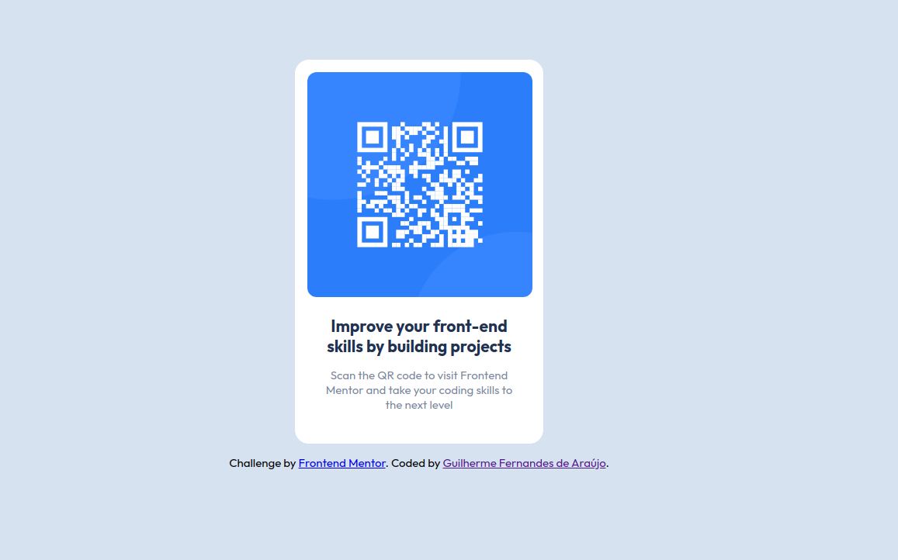

# Frontend Mentor - QR code component solution

This is a solution to the [QR code component challenge on Frontend Mentor](https://www.frontendmentor.io/challenges/qr-code-component-iux_sIO_H). Frontend Mentor challenges help you improve your coding skills by building realistic projects.

## Table of contents

- [Overview](#overview)
  - [Screenshot](#screenshot)
  - [Links](#links)
- [Built with](#built-with)
- [Author](#author)

## Overview

### Screenshot

### Links

- [Solution URL: ](https://your-solution-url.com)
- [Live Site URL: ](https://your-live-site-url.com)

## Built with

- HTML5
- CSS variables
- Flexbox

## Author

- [Guilherme Fernandes de Araújo](https://www.your-site.com)
